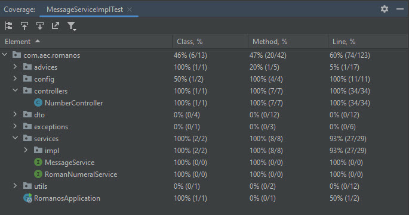

# Desafio Romano

El viernes 11/07/2024 18:45 hs, recibi un desafio con dos fases, la primera de ella se debe entregar el lunes siguiente y la ultima el miercoles 17 del mismo mes. Y el enunciado dice asi:

-----------------------------

# Kata Números romanos

### Fase 1

Desarrollar un componente que permita convertir números enteros a romanos y viceversa según el siguiente esquema: 

* 1 ➔ I
* 2 ➔ II
* 3 ➔ III
* 4 ➔ IV
* 5 ➔ V
* 9 ➔ IX
* 21 ➔ XXI
* 50 ➔ L
* 100 ➔ C
* 500 ➔ D
* 1000 ➔ M


En ambos métodos de conversión, el componente debe validar si se ingresa un valor no permitido y responder con una excepción personalizada. 

**Plus Fase 1:** Aplicar TDD o al menos hacer Tests unitarios del componente probando al menos 2 border cases para cada método de conversión.


### Fase 2 

Exponer el método del componente que convierte valores numéricos arábigos a romanos en un endpoint (GET) 
Exponer el método del componente que convierte valores numéricos romanos a arábigos en un endpoint (GET)

**Plus Fase 2:** Aplicar TDD (Test de integración usando la suite de Spring). 


### Requerimientos/Restricciones

**Fase 1 y 2:** Usar Java 17 o superior. Maven o Gradle para la gestión de dependencias. 
Para los puntos plus de cada fase, en lo relacionado a la infraestructura de tests se pueden usar las siguientes herramientas JUnit5+Mockito o Spock y Spring Boot Testing. 
**Fase 2:** Usar Spring boot 3+.

Completar y modificar este readme e incluirlo como parte del repositorio agregando detalles sobre cómo construir el proyecto desde cero y ponerlo en ejecución. 

***

<h1 align="center">API REST Number Challenge</h1>

* :argentina: Adrian Camus [LinkedIn](https://www.linkedin.com/in/acamus79/ ) - [GitHub](https://github.com/acamus79)

<p align="center">
<a href="https://github.com/topics/java" target="_blank"></a>
<a href="http://localhost:8080/api/swagger-ui/index.html" target="_blank"></a>
<a href="https://documenter.getpostman.com/view/23097436/2sA3e5f94L" target="_blank"></a>
</p>

Este proyecto implementa un servicio REST para convertir números entre su representación arábiga y romana. Se han implementado cuatro endpoints: dos de tipo GET y dos de tipo POST. Todos realizan las mismas dos funciones, con la diferencia de que los endpoints GET reciben el valor como un parámetro en la URL, mientras que los endpoints POST lo reciben en el cuerpo de la solicitud.

Además, se han implementado pruebas unitarias para el controlador, el servicio de conversión de números y los DTO con sus respectivas validaciones. También se ha añadido internacionalización de los mensajes a través del encabezado Accept-Language, soportando inglés (en), español (es) y portugués (pt). La configuración de la internacionalización también cuenta con pruebas unitarias, logrando un alto nivel de cobertura. (100% en controlador y servicios)



## Características

- Conversión de números arábigos a romanos (1-3999)
- Conversión de números romanos a su representación arábiga.
- Manejo de errores personalizado
- Validación de entrada
- Internacionalización de mensajes
  - Inglés (por defecto)
  - Español (es)
  - Portuges (pt)

## Tecnologías utilizadas

- Java 17
- Spring Boot 3.3.1
- Maven
- Swagger
- Docker
- Como IDE se utilizo IntelliJ IDEA 2023.1.4
- También utilice Postman v11.3.2

<div style="display: inline_block"><br><br>
  <a href="#" target="_blank"></a>
  <a href="#" target="_blank"></a>
  <a href="#" target="_blank"></a>
  <a href="#" target="_blank"></a>
  <a href="#" target="_blank"></a>
  <a href="#" target="_blank"></a>
  <a href="#" target="_blank"></a>
 </div>

## Cómo ejecutar

  1. Clona el repositorio:
  ``` git clone https://github.com/acamus79/desafio_romano.git ```

#### <em>Si tienes docker desde el directorio raíz, puedes ejecutar el comando ``docker-compose up``, para descargar la imagen compilada desde mi repositorio personal docker hub.</em>

- Para Docker también puedes utilizar unos scripts de bash o de powershell que estan en la raiz del repositorio
  - buildandrun.sh (linux bash)
  - buildandrun.ps1 (Windows Powershell)

Si no tienes docker deberás tener java 17 instalado, se puede ejecutar seguiendo estos pasos:

  1. Navega al directorio del proyecto: ``` cd romanos ```
  2. Ejecutar el proyecto ``` mvn spring-boot:run ```
     - o si lo prefieres compilar el proyecto: ``` mvn clean install ```
     - Ejecuta la aplicación compilada: ``` java -jar target/romanos-0.0.1-SNAPSHOT.jar ```

La aplicación estará disponible en `http://localhost:8080`.

## Accede a la documentación de la API:

A través de Postman y Swagger

| Documentacion |                                                    Link                                                     |
| :-----------: | :---------------------------------------------------------------------------------------------------------: |
|    POSTMAN    |        <a href="https://documenter.getpostman.com/view/23097436/2sA3e5f94L" target="_blank">LINK</a>        |
|    SWAGGER    | <a href="http://localhost:8080/swagger-ui/index.html" target="_blank">LINK</a> (sólo si se está ejecutando) |

## Endpoints

  - /api/v1/toRoman
  - /api/v1/toNumber
  
_____
<p align="center">
 <a href="https://acamus79.github.io" target="_blank"></a>
 <a href="#" target="_blank"></a>
 <a href="#" target="_blank"></a>
</p>
